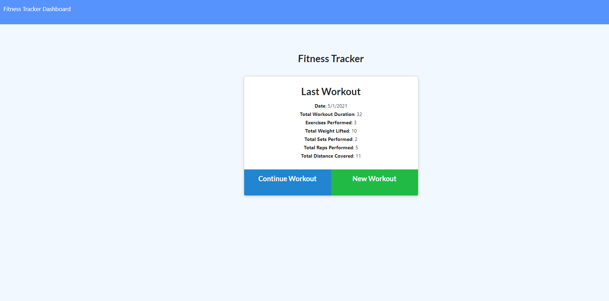

# Fitness Tracker
 

## Description 
This is an app designed to help the user by logging the details of workouts
## Table of contents
- [Description](#Description)
- [Installation](#Installation)
- [Usage](#Usage)
- [License](#License)
- [Contributors](#Contributors)
- [Test](#Test)
- [Repository Link](#Repository)
- [Questions](#Questions )
- [GitHub Info](#GitHub) 
## Installation
 -To install this please use npm install
## Usage
To track ones workouts
## License
MIT
## Contributors
Here is a list of anyone who has contributed to this Jamie Burchell
## Test
test
## Repository
https://github.com/Burch531/Fitness_Tracker
## Questions
- Please send any questions to jburchell531@gmail.com
## GitHub
(https://github.com/Burch531)

Screenshot of a Fitness Tracker that is created 

